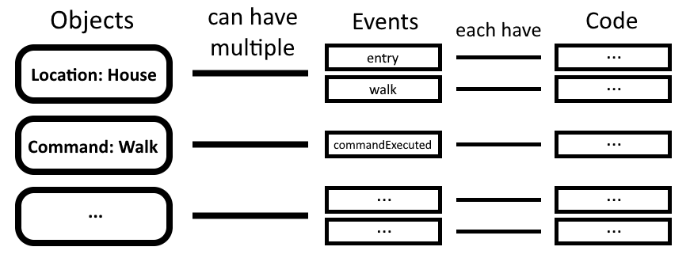
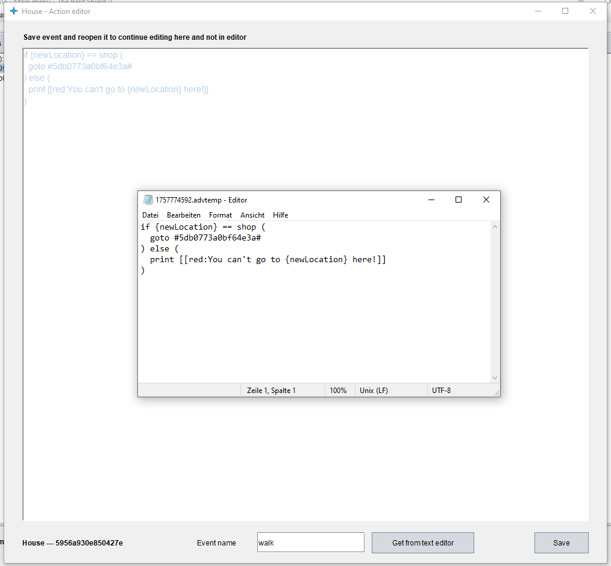

# Events
___
Every object can have events. Events are containers for code that can be executed. Here's a small diagram showing the hierarchy:  
  

## Predefined events 
When creating an object, there can be predefined events. A list of all of them can be found here:  

| Object Type         | Event Name            | Parameters                              | Description                                                                                  |
|---------------------|-----------------------|-----------------------------------------|----------------------------------------------------------------------------------------------|
| **location**        | examine               | name                                    | when player uses 'examine' command. Compare {name} to check if entity should be examined     |
| **location**        | entry                 | comeFromLocation, gotoLocation          | when location is entered via goto                                                            |
| **location**        | exit                  | comeFromLocation, gotoLocation          | when leaving location via goto                                                               |
| **location**        | walk                  | newLocation                             | executed when using walk command. Check here where to go next based on {newLocation}         |
| **npc**             | talkTo                | name                                    | every NPC at location of player calls their talkTo event when player uses                    |
| **npc**             | examine               | name                                    | when player uses 'examine' command. Compare {name} to check if entity                        |
| **item**            | use                   | - - -                                   | when player selects 'use' in inventory                                                       |
| **item**            | pickup                | amount, inventory                       | when item goes into inventory                                                                |
| **item**            | drop                  | amount, inventory                       | when item leaves inventory                                                                   |
| **item**            | examine               | name                                    | when player uses 'examine' command. Compare {name} to check if entity should be examined     |
| **inventory**       | pickup                | amount, item                            | when item goes into inventory                                                                |
| **inventory**       | drop                  | amount, item                            | when item leaves into inventory                                                              |
| **battleMap**       | start                 | - - -                                   | when battlemap is opened and intro is done                                                   |
| **battleMap**       | end                   | outcome                                 | when either of the events 'fail' or 'win' take place                                         |
| **battleMap**       | walkOnTile            | x, y, entity                            | when entity walks on a tile; {entity} = npc's uid / 'player'                                 |
| **battleMap**       | damage                | attacker, victim, damage, item          | when entity attacks entity; {attacker,victim} = npc's uid / 'player'                         |
| **battleMap**       | dies                  | entity                                  | when an entity reaches 0 HP (npc's uid / 'player')                                           |
| **battleMap**       | walkOnItem            | x, y, entity, item                      | when entity walks on item                                                                    |
| **battleMap**       | rightClick            | x, y                                    | when player right clicks on tile                                                             |
| **lootTable**       | dropLoot              | - - -                                   | when loot table is dropped into an inventory; may only contain a loot table, not actual code |
| **lootTable**       | dropLootCode          | inventory                               | when loot table is dropped into an inventory                                                 |
| **popup**           | popupOpened           | name								    | when a new popup instance is created                                                         |
| **popup**           | clickListener         | componentType, componentName, popupName | when a component with a click listener executes its event                                    |
| **eventCollection** |                       |                                         |                                                                                              |
|  _--> General_      | launch                | - - -                                   | when adventure is selected                                                                   |
|  _--> General_      | intro                 | - - -                                   | when character creaction is done and intro launches                                          |
|  _--> General_      | introOver             | - - -                                   | when intro is over and adventure starts                                                      |
|  _--> General_      | exit                  | - - -                                   | when adventure is stopped                                                                    |
|  _--> General_      | audioStart            | uid                                     | when audio starts playing                                                                    |
|  _--> General_      | audioStop             | uid                                     | when audio stops playing via 'audio stop'                                                    |
|  _--> General_      | audioEnd              | uid                                     | when audio stops playing in any way                                                          |
|  _--> General_      | showAvailableCommands |                                         | when player clicks `Show commands` on main frame                                             |
| **customCommands**  | commandExecuted       | ...                                     | when customCommand is executed; parameters depend on customCommand                           |  

## Editing an event
An event can be opened and edited via the object frame. The editor looks like this:  
  
If the editor does not meet your demands, you can always use the button `Open in text editor` to open the code in any text editor which makes it a lot easier when writing large amounts of code. As soon as you save the file, the code in the action editor gets refreshed.  
  

## Calling an event
When calling an event via the `execute` command you can pass as many parameters over as you want. As seen in the table above, certain predefined events already pass parameters automatically, such as UIDs and more. You can use these parameters just as all other variables: `{variableName}`  
One thing to note is that you can't use any modifiers such as `{variableName}.toUppercase()` on these. You would first need to enclose them in the `{value|[VALUE]}` variable: `{value|{variableName}}.toUppercase()`

As already said, you can call an event with the `execute` command. The full syntax is:  
`execute event [EVENT] as [SELECTOR] {[PARAMETERS]}`  
This means you will need these three parameters:  

 * `[EVENT]` - An event variable defining what events to execute
 * `[SELECTOR]` - What objects will execute this event
 * `[PARAMETERS]` - The parameters you want to pass over to the event

The event variable looks like this:  
`{event|[SELECTOR]|[EVENTNAME]}`  
This means you need to specify the object you want to execute the event from and the event name itself.  
  
The parameters look like this:  
`{variableName:[VALUE];variableName2:[VALUE]}`  
Meaning you split multiple parameters with a `;`. You can leave it empty if you don't need any paramteters.  
  
Using the `{this}` variable will fill in the UID of the object executing the event (the ones defined with `as [SELECTOR]`). `{this}` also needs to be enclosed in a `{value|[VALUE]}` variable to be able to use modifiers.
  
## Examples
`execute event {event|#uid:{player|location}#|{input|line}.toLowercase()} as #uid:{player|location}# {}`  
  
`execute event {event|#uid:{player|location}#|walk} as #uid:{player|location}# {newLocation:{nLoc}}`  
  
`execute event {event|#uid:{this}#|examine} as #uid:{this}# {name:{name}}`  

