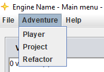
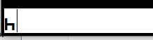
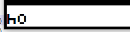
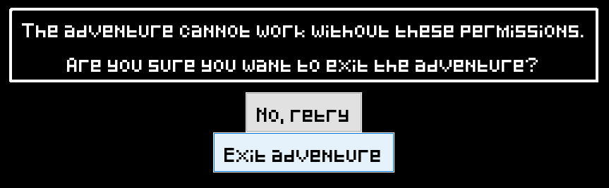
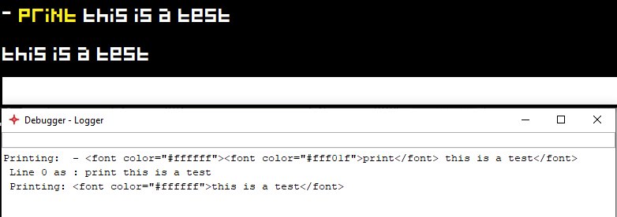
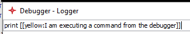
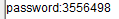
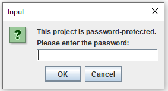

# Player / Project settings
___ 

You can find the player and project settings using the drop down menu of the main frame: `Adventure > Player` and `Adventure > Project`  
  
You can add custom settings by adding new lines following the same scheme (`name:value`).  

## Player settings
These are all of default settings.
Most of them are self explanatory, but here's a short explanation of what they do.  

 * `name` - the name the player chooses after rolling his attributes
 * `gold` - simply the amount of gold that is displayed in the player stats frame
 * `health` - the amount of health the player has; used for battleMaps; this amount of health will be added to the amount the player gets through the character creation (simply the `agility` value)
 * `maxHealth` - the maximum amount of health the player can have. Setting the variable `health` to a greater value will result in it snapping back to `maxHealth`
 * `location` - the current location UID of the player
 * `inventory` - the player inventory UID
 * `battleMapImage` - the image UID that is being used on the battleMap as player image
 * `globalTalentModifier` - modifies the DC of every talent roll by the given value
 * `courage` - this and the following values are being overwritten when the player creates his character
 * `wisdom`
 * `intuition`
 * `charisma`
 * `dexterity`
 * `agility`
 * `strength`

These ones get added as soon as the adventure gets played:

 * `holdingMain` - what item the player has equipped in his main hand
 * `holdingSecond` - what item the player has equipped in his offhand
 * `holdingArmor` - what item the player has equipped as armor

## Project settings
These settings define things on a global level that are being used by multiple things. More on the individual settings later.

 * `name` - The adventure name (can be different from the file name) (displayed with description, version and author on intro frame)
 * `description` - Description of the adventure
 * `version` - Custom adventure version string
 * `author` - Author of the adventure
 * `image` - Adventure image is displayed on intro frame and when player stats is minimized
 * `language` - Can be [english;german]
 * `autocomplete` - When player taps `tab` on main frame of player, these terms can be autocompleted (split by `,`)
 * `objectFrameVariables` - Defines what variables will be displayed on the object frame (split by `,`)
 * `permissions` - Permissions the adventure wants
 * `showIntro` - [true;false] shows or hides the intro and character creation
 * `debugMode` - [true;false] debug mode on or off
 * `debugModeForceable` - [true;false] is set to `true`, the adventure can be set to debug mode via arguments
 * `password` - Password that needs to be entered to be able to open the adventure in the editor
 * `requirePasswordToPlay` - Password also needs to be provided when playing (truely encrypts file)
 * `actionEditorOpenDirectlyInExternalEditor` - Is only important when editing an adventure. If set to `true`, the events will instantly open in your text editor and not in the action editor

Okay, some of these need further explanation:  
  
### `autocomplete`
For example: `autocomplete:hello,how are you`  
 -->   
 -->   
You can use this to make it easier for the player to type in the same commands or parameters repeatedly.

### `permissions`
The possible permissions are:

 * `web` -               allows the use of the 'web' variable
 * `fileread` -          allows reading files from the advfiles fold
 * `filewrite` -         allows writing files to the advfiles folder
 * `filereadanywhere` -  allows reading files from the entire system
 * `filewriteanywhere` - allows writing files to the entire system
 * `fileopen` - 		 allows executing files inside of the advfiles folder
 
Without these permissions you are not able to use the according features. Before launching the adventure, the player needs to agree that you may use these permissions:  
  
If the player doesn't agree, the adventure cannot be opened:  
  
You can split multiple permissions with `,`.

### `debugMode`
Using `true` as parameter activates debug mode, which unlocks a lot of features that make it easier to test and debug the adventure.

 * The engine starts logging almost everything that happens. You can see what it logs in the special log frame that opens as soon as the main frame opens. Using the command `log dump` you can also dump all of the current log into a file.
   
 * You can also execute commands from the debugger or even from the main frame by simply typing them:  
   
   

### `password`
Setting a password means that you will need to enter this password every time from now on if you want to edit the adventure.  
  
After closing and reopening the project settings frame, the password will be hashed. If you want to set a new password, simply replace the hashed version through a new password.  
  
You will need to enter the password:  
  
If you somehow forgot your password, you can [contact me](mailto:mail@yanwittmann.de?subject=Feedback%20to%20the%20RPG%20Engine) so that I can help you with recovering your adventure.