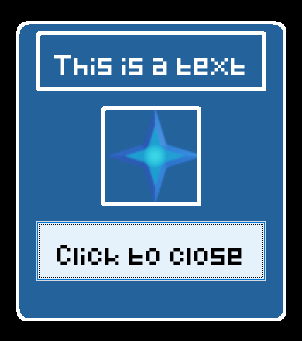
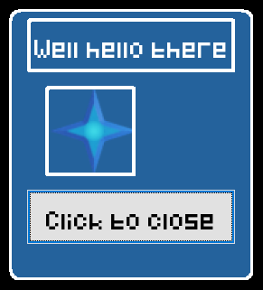

# Popups
___

Popup objects can be used to create customized frames that the player can interact with.  

## Creating a popup
The setup code that defines how the frame looks is defined in the event `popupData`.  
The code is structured in this way:  

	width height
	popup; attribute:value; attribute:value
	componenttype; name; attribute:value; attribute:value
	componenttype; name; attribute:value; attribute:value

The **first line** (`width height`) contains the size of the popup (`width` and `height`)  
The **second line** (`popup; attribute:value; attribute:value`) can contain optional settings for the entire frame:

 * `background` - background color of the frame (default: `background`)
 * `alwaysOnTop` - either `true` or `false` (default: `false`)
 * `canBeClosed` - either `true` or `false` (default: `true`). If set to false, the player cannot use the mouse wheel to close the popup

The **following lines** (`componenttype; name; attribute:value; attribute:value`) each contain a new component with parameters splitted by a `;` each (you can use a whitespace after the `;`).  
`componenttype` can have the following values:

 * `text`
 * `image`
 * `button`

The `name` is the name that is used to address the component in the popup. More on that later.  
The rest of the parameters are attributes that you can set depending on what `componenttype` you picked:

 * `text` - can be used by `text` and `button` and describes the text that the component shows
 * `fontsize` - can be used by `text` and `button` and is equals to the text size
 * `uid` - used by `image` to get the image with the matching `uid`
 * `x` - the x coordinate of the component on the popup
 * `y` - the y coordinate of the component on the popup
 * `width` - the width of the component
 * `height` - the height of the component
 * `visible` - either `true` or `false`
 * `anchor` - either `left`, `right` or `center`
 * `clickListener` - adds a `clickListener` to the component; the value is the event name that is being executed when clicked (passes `componentType`, `componentName`, `popupName`)
 * `border` - adds a border around the component with the given color
 * `hoverEffect` - only for `text`; either `true` or `false`. Makes the text have an effect when hovered over. Text needs to have a `clickListener` for this in order to work and has to be set before the `clickListener`

## Opening popups
You can create a new instance of a popup using the command

	popup [SELECTOR(popup)] open as [VALUE(name)]

The popup that is created is then stored under the name of `[VALUE(name)]`. This name is used to address it later.  
Opening a popup calls the event `popupOpened` of the popup object and passes the `name` that it was given.

## Modifying popup data
You can set the attributes of the components on a popup after creating it using the command

	popup [SELECTOR(popup);VALUE(name)] set [VALUE(component)] attribute [VALUE(attribute)] to [VALUE(value)]

The selected popup instance (either selected through the popup object uid or the name that was defined when creating) will set the component's (with the component name defined in the event `popupData`) attribute to the given value.  
Note that listeners and hoverEffects cannot be modified after creation.

## Closing popups
You can close opened popup instances using the command

	popup [SELECTOR(popup);VALUE(name)] close

This closes the popup of all of the selected popup objects using a selector or the popup with the given name.

## Variables
You can get the popups that are currently opened with the variable:

	{popup|[uids;names]}

Which either returns all of the currently open popup uids or the individually defined names

## Example
Let's say that this is the code that is inside of the event `popupData` which describes how the popup looks:

	270 300
	popup; background:dark_blue; alwaysOnTop:true; canBeClosed:true
	text; mainText; x:20; y:10; width:230; height:60; text:This is a text; border:white_border; clickListener:clicked; anchor:center
	image; img; x:85; y:85; width:100; height:100; border:white_border; clickListener:clicked; image:78c27476e80e4d6a
	button; confirmButton; x:20; y:200; width:230; height:60; text:Click to close; clickListener:clicked

And this is the code inside of the `clickListener` event `clicked`:

	print you clicked me! This is the data that was passed over: {componentType} {componentName} {popupName}
	if {componentType} equals button (
		popup {popupName} close
	)

Using the command `popup #type:popup# open as displayData` opens up the popup:  
  
We can edit the popup using:

	popup displayData set mainText attribute text to Well hello there
	popup displayData set img attribute x to 40

This makes the popup look like this:  
  
Clicking the close button closes it again, since this is what we defined in the event `clicked`. But we can also close it using one of these commands:

	popup displayData close
	popup #type:popup# close

