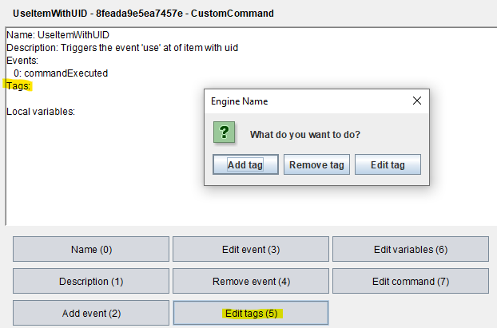

# Tags
___

Tags can be given to all objects and used to organize them into different categories. You can for example give all items of a certain type a certain tag to more easily fetch them with a selector.

## Tags with pre programmed meaning
There are a few tags that can set differnt attributes. This is a list of all of them:

| Object Type     | Tag name            | Description                                                                                                        |
|-----------------|---------------------|--------------------------------------------------------------------------------------------------------------------|
| **item       ** | viewCanBeObstructed | Removes check if there is an obstacle between you and the enemy on battleMaps (item can be used through obstacles) |
| **npc        ** | canNotChangeWeapon  | Disables the option to automatically change the selected item in a fight for the npc                               |

## Using tags
To give or remove a tag, either do that in the adventure editor:  
  
Or using the `tag` command:  
`tag [SELECTOR] [add;remove] [VALUE(tag)]`  
  
You can use them to adress objects in a selector with the `tag` parameter:  
`#tag:[VALUE(tag)]#`