# Creating your first adventure
___

## Creating the adventure & objects
If you read through getting started, you should have already created a new adventure. If not or if you want to restart, hit `ctrl+shift+n` to create a new adventure. You can select the language the custom command presets and the talent presets are loaded in. You can also choose what talents to load in.  
  
Now create a new object with `ctrl+n`: Select the first option `Location`.  
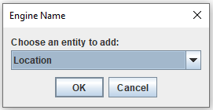  
A frame with the object data will open.  
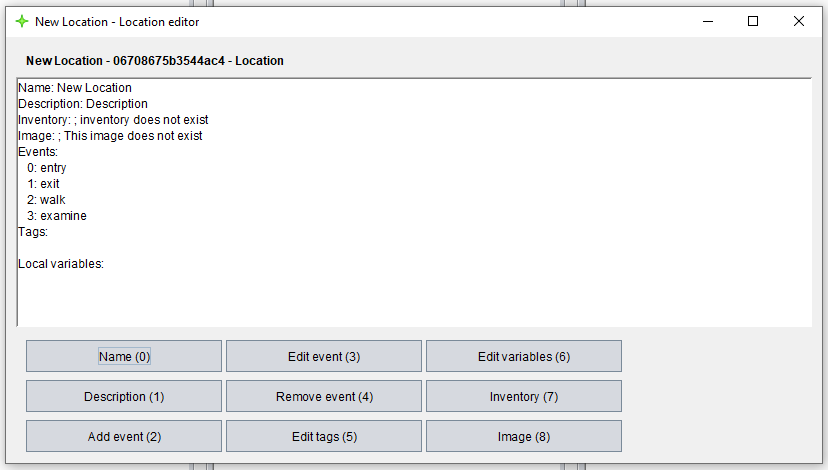  
Use the shortcut `ctrl+0` or the button `Name` to change the name to whatever you want. Do the same with the description. Let's try to add an image to the location. To do that, we need to add an image first.  
Close the frame with `esc`. You might notice that the name of the location is still the default name. Use `ctrl+r` to refresh the data.  
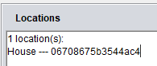  
Now use `ctrl+n` to add an image. Select whatever image you want to use. You can close the frame that shows the image after adding it.  
  
To scroll through the main frame, use either `ctrl+q` / `ctrl+scroll up` to scroll to the left or `ctrl+w` / `ctrl+scroll down` to scroll to the right. Now scroll to the right until the panel `Images` appears. If you can see your image, everything worked. Scroll back to the `Location` panel and select your location's UID. Hit `ctrl+e` to open the edit frame again. Then use the image button or `ctrl+8` to add the image to the location:  
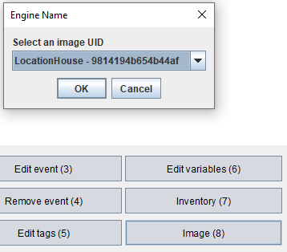  
Let's set this location as the player's starting location. Close the frame and use the drop down menu at the top to select the `Player Settings`. Copy the UID of the location and paste it behind the variable `location:`.  
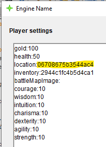  
Time to save the adventure with `ctrl+s` and to try it out!

## Opening adventures as a player
Launch the player using the launcher, select your adventure and hit `OK`:  
  
Now you need to create a character. Do this as usual.  
  
If you don't want to create a character every time you need to test your adventure, you can set the `showIntro` variable to `false`. Here you can also set things like the adventure name, description, icon, version, author, language and more. More on these settings later.  
  
The player stats frame now shows the location you created! But there's not much else we can do yet. So, let's return to the editor.  
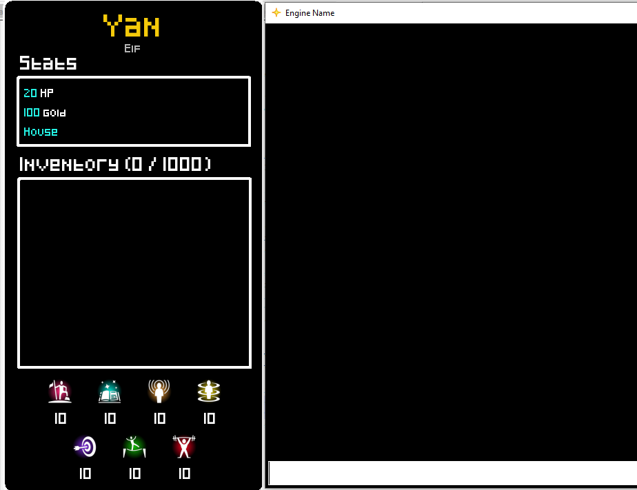  

## Coding events & custom commands
Let's make it possible to walk between different locations. Create a new location to which we want to go.  
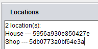  
Remember `customCommands`? We will be using one of those to do this. Scroll all the way to the right until you can see the `CustomCommands` panel. There should already be a few default ones. The one that we are interested in is the `Walk` command.  
  
Open it by selecting the command's UID and hitting `ctrl+e`. Now take a look at the `Events` list. There is already one with the ID `0` named `commandExecuted`.  
  
Use the button `Edit event` or the shortcut `ctrl+3` and type in the ID `0` to open it. The action editor frame will pop up.  
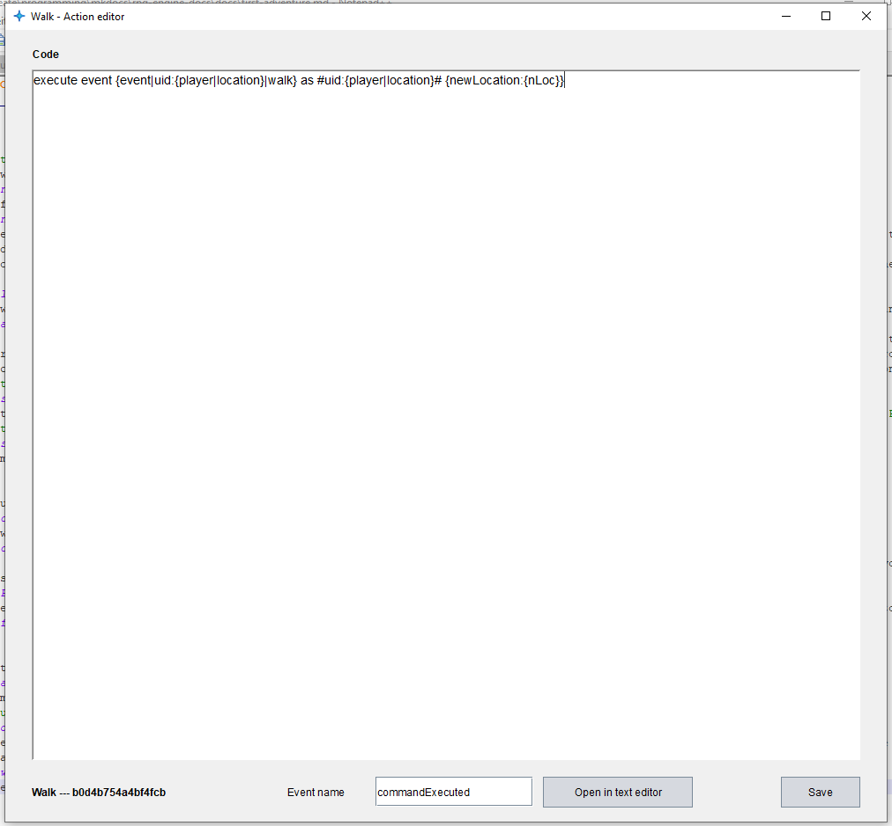  
This is the code that is being executed as soon as the command is detected. I know, all of this seems a bit overwhelming at first, so let's take a step back.  
Events basically are functions with code inside of them that you can execute. Every object can have these events containing code. You can create your own events but there are predefined events that get triggerd automatically. The `commandExecuted` event is one of the pre programmed ones, it already contains code. Here's a small diagram showing the hierarchy:  
  
Leave the action editor open and on the walk command's object frame click on `Edit command` or use `ctrl+7` to open the command editor.  
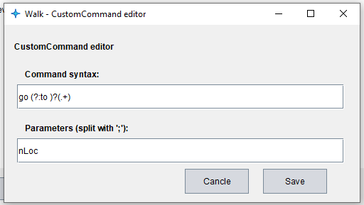  
As you can see, the command syntax `go (?:to )?(.+)` and the parameter `nLoc` that the command passes over are both defined here.
The syntax is in a format known as a regular expression. A regular expression can grab information out of a formatted string. What does this one mean `go (?:to )?(.+)`? Ignore the brackets `()` and `?:` for now. In this case, it requires the string to start with `go `. Then there _might_ follow a `to` which is indicated by the `?` behind the brackets making them optional. The rest can be any text `.+`. Okay, now to the brackets. They are there to catch the parameters, in this case the location we want to go to. This is why there are brackets around the `(.+)`. The first pair of brackets are required since we want to make the `to ` optional and therefore need the `?` behind the entire string. But we are not interested in wether the player typed a `to `, which is why we tell the regular expression to not fetch what is inside of the brackets using `?:` at the beginning of the brackets.  
I know this seems pretty complicated at first, but try using the website [https://regexr.com/](https://regexr.com/) to learn more about regular expressions and you too will agree that they are a great thing.  
The parameter `nLoc` is then being passed over to the event where you can use it with `{nLoc}`, but more on these types of variables later. The code that the event executes consists of only one line as you can see above and here:  
`execute event {event|uid:{player|location}|walk} as #uid:{player|location}# {newLocation:{nLoc}}`  
You don't need to understand it yet, we will cover all of the commands later but what it does is to trigger the `walk` event of the `location` object the player currently is at and passes a parameter `newLocation` containing what the player typed. Now close all those frames and go back to the object editor of the player location (the location you created first). Open the event `walk` by pressing the button `Edit event` or the shortcut `ctrl+3` and entering the ID `2`.  
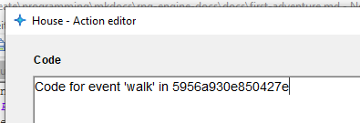  
This is what an empty event looks like. Let's first simply print the parameter the player typed into the console. You can print text using the `print` command. Type in `print You want to go to: {newLocation}`. This will print the parameter `newLocation`, which happens to be the text the player typed in.  
  
Let's try that out. Close the frame to save the code and save the adventure. Start up the adventure in the player and type in `go to shop`.  
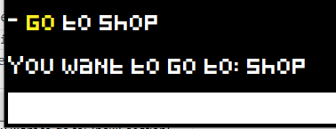  
There you go, your very first event! Also, notice that the word `go` is automatically printed yellow. This is always done for the first word of a custom command. But it still doesn't allow you to move the player anywhere. To do this, we need to add the `goto [SELECTOR(location)]` command. It requires a... selector as a parameter? Again, something new.

## Selectors
A selector selects specific objects that you created. The result of a selector can then for example be used as a parameter. An example for a selector is: `#type:location;limit:1;tag:test#`  
A selector always consists of two `##` with parameters inside of it. These parameters are each split by `;`. When evaluating a selector, the engine starts with a list of all objects and sorts all of the ones out that don't match the parameters. The possible parameters are:  

 * `uid` - checks the object `UID`
 * `name` - checks for the object name
 * `type` - checks the object type (see objects & types on [getting started](../getting-started.md))
 * `tag` - checks if object has a tag
 * `location` - checks if an NPC has a given location
 * `sort` - `[first;last;random]` determines the order the objects get sorted out for the `limit` parameter (needs to be set before `limit`)
 * `limit` - sets the maximum amount of objects to be selected
 * `inventory` - selects all items in a given inventory
 * `expr` - `[VALUE][==;>;<;>=;<=;!=][VALUE]` checks if an expression is true

It can also simply contain a `UID`, like so: `#702c14f1b34a45e5#`  

## if / else
Using conditions, we can decide if we want to execute certain parts of the code or not.  
`if<not> [VALUE] [==;>;<;>=;<=;!=;contians;matches;equals] [VALUE] (  
...  
) else (  
...  
)`  
If the condition is `true`, the `if` branch is selected, if it is `false` the `else` branch is executed. You can also invert this by using `ifnot`.  
There are two more condition types:  
`if<not> [SELECTOR] (` - checks if a selector has at least one result  
`if<not> talent [TALENTNAME] [+;-] [VALUE(add/subtract)] [true;false(visible)] [true;false(forceAutoRoll)] [VALUE(text)] (` - rolls a talent

## Finishing the event
The selector we would use to go to the second location would then be `#uid:5db0773a0bf64e3a#` (or simply `#5db0773a0bf64e3a#`), since the UID of the second location is `5db0773a0bf64e3a`. The full command: `goto #5db0773a0bf64e3a#`  
Now we need to check what the player typed in to check if we should really go to the shop. We can check this with the condition:  
`if {newLocation} == shop (`  
With all of that, the final event should look something like this:  
  
Time to save and try it out!
  
It works: When we try to go south, we get the message that we can't go there but when we want to go to the shop our location is set to the shop (as seen in the player stats frame). If you want, you can also color the text that is printed: `[[red:You can't go to {newLocation} here!]]`  
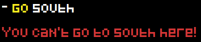  
As I said, there are other events that get triggered automatically when certain things happen in the engine. The `goto` command triggers two other events: The `exit` event of the location the player leaves and the `entry` event of the location the player walks to. Both of these have the following parameters: `{comeFromLocation,gotoLocation}`  
If we fill these in:  
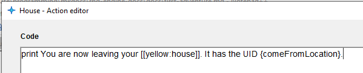  
  
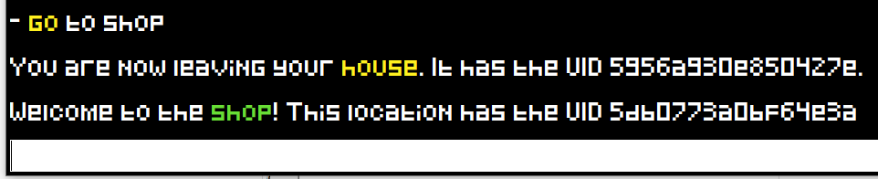  
One small tip for editing events: You can press the button `Open in text editor` to open the code in the editor which makes it a lot easier to write large amounts of code. As soon as you save the file, the code in the action editor gets refreshed.
  
Okay, these were the basics that you need to know to create your very own adventure. But that's not all there is to know; it's just the tip of the iceberg! Now go read the rest of the documentation via the drop down menu above to be ready!
