# Battle Maps
___

Battle maps are one of the most complex objects. They can switch the game into battle mode, which is the second state the game can be in. Battle maps are the place where you can let the player fight npcs.

## Creating battle maps
In the object editor of a battle map, use the button `Edit battle map` or press `ctrl+7` to open the battle map editor.  
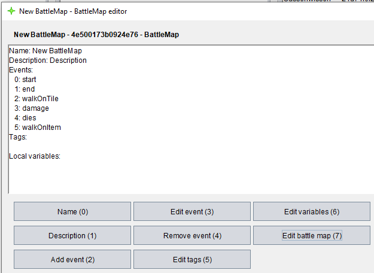  
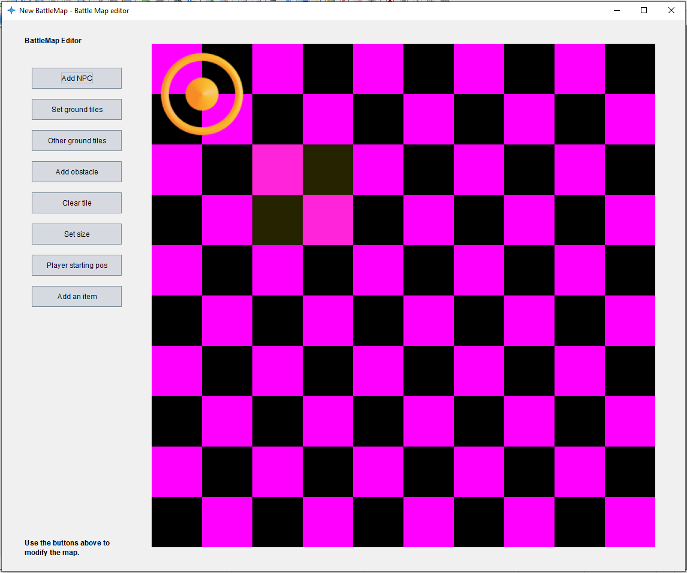  
This is how the editor looks like if you just started creating a new battle map. We don't really want it to look like this though, so let's get started:  
First, we need to add a few images to our project, otherwise it would look pretty ugly. So, in the main frame press `ctrl+n` and select image to add your images.  
(Since I'm a really bad artist: Character art by [Sven Thole](https://assetstore.unity.com/publishers/31468))  
After adding a ground tile, an enemy, an obstacle and flowers, we are ready for the first steps. Click on `Set ground tiles` and select your ground tiles.  
  
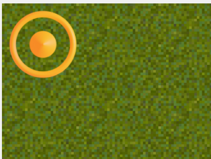  
Now that looks a bit better. How about we add obstacles? Click on `Add obstacle` and select your obstacle image. You are now in stamp mode where you can click any tile and it will add the object to it.  
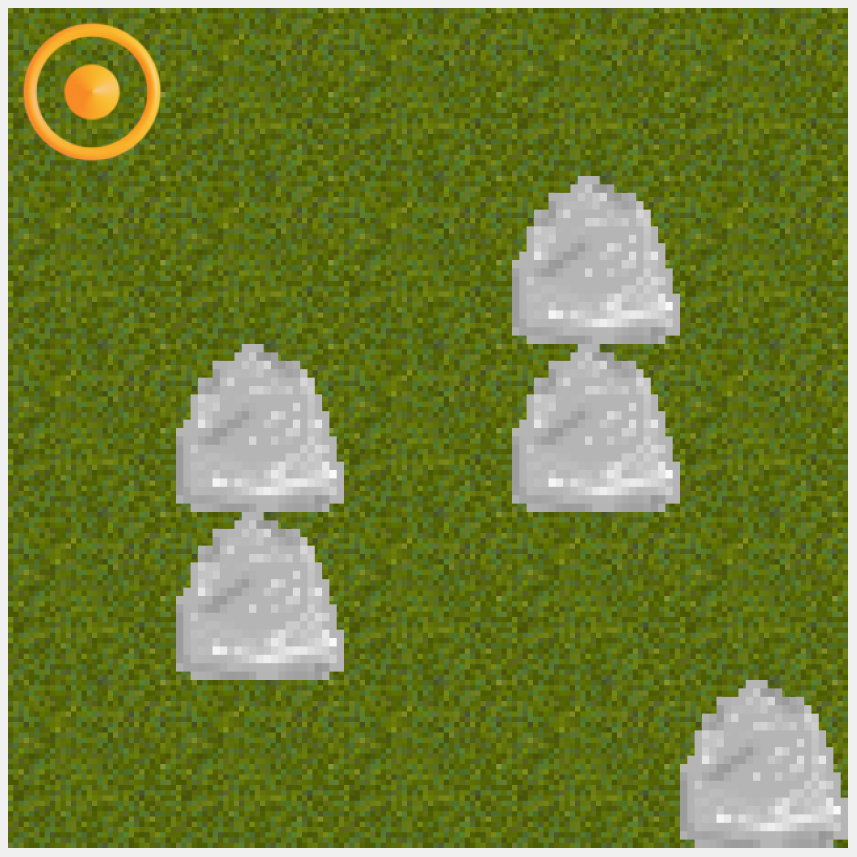  
If you missclicked, you can always clear the tile using the `Clear tile` button and clicking the tiles you want to remove everything from.  
`5x5` is a bit small for a battle map, let's try making it larger. Click on `Set size` and type in whatever number you want. Just don't make it too large. Now you can add more interesing obstacle formations.  
  
You were probably wondering what the yellow circle in the upper left corner is. This is the player starting position. You can change it by selecting the `Player starting pos` button and clicking the tile you want the player to start at.  
  
Speaking of the player, let's add a battleMap image to the player. Go back to the main frame and under `Adventure > Player` put the UID of the player image to the entry `battleMapImage`:  
  
The image will only be displayed when playing the adventure. As a last step, let's add flowers to the battleMap. Select `Other ground tiles` and select your image. Now you can again click on all tiles you want the image to appear.  
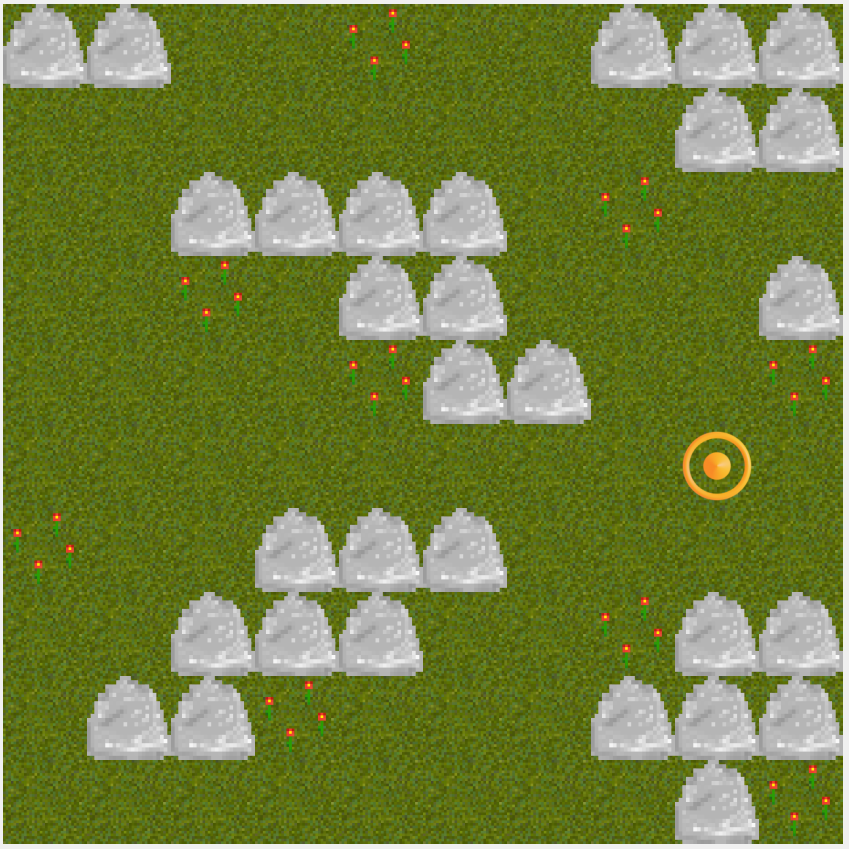  
NPCs are a bit more tricky, which is why they have their own chapter:  
‏‏‎ ‎  
## NPCs & Items
Before you can add NPCs to your battle map, there are a couple of things we need to do first: The NPC will need an inventory and the inventory needs items. So, let's begin with the items:
Let's add a sword and a bow. To add these items, press `ctrl+n` on the main frame and select `Item Type`. Name the item `Sword` and choose an image for it. Now for the damage the item should deal. The engine can roll all kinds of damage, you can check unter [items](items.md) to learn more how to create the damage roll string. Let's make our sword have a damage of `1W6 + 3`.  
Let's ignore the rest of the variables for now. This is what your item should look like:  
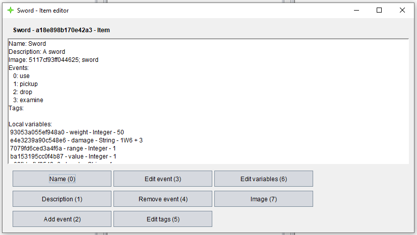  
Repeat the same for the bow: Create an item, name it `Bow`, set a description, the image and the damage to maybe `1W3 + 1`. Since the bow has a higher range than the sword, set the variable `range` to `5`.  
  
Now open the `PlayerInventory` that has been created automatically upon creating your adventure and click on `Edit inventory` or use `ctrl+7`. Add both of the items to the player inventory by using the `Add` button at the bottom.
  
Now create one more inventory for the NPC we are about to create and give him the same items so that we can try out all of the weapons later. Now create the NPC and give him a name, a description and the inventory we just created for him.  
The object with the highest `courage` value begins the battle followed by the other lower values in their order. So, you can set the `courage` value to something higher, like `15`. If you want him to be faster, you can modify the `speed` and if you want him to be stronger without any item used as weapon you can increase the `dmgNoWeapon` value.  
  
But those values are good enough for me so let's add him to the battle map. Click on `Add NPC` and select the NPC we just created. Also, select the enemy image we previously added.
  
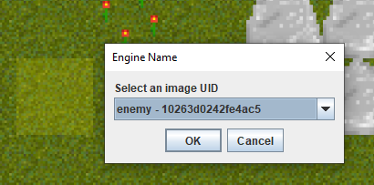  
This is how your map should look like. But wait.. There's a second NPC! Try adding this one as well!  
  
All that's left to do is to name your battleMap and to give it a description. These two values will appear later before the battle map begins.

## Playing battle maps
Make sure you have the debug mode enabled (see `Adventure > Project`) before starting. You can also disable the intro there. Now save your adventure and head over to the player. When opening your adventure, you should already see your inventory with the two items:  
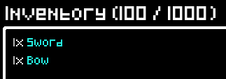  
To open the battle map, use the `battle start [SELECTOR(battleMap)]` command:

	battle start #name:[YOUR MAP NAME]#

The frame should open and display the name and the description before starting.  
  
If you check out the debugger, you can see the turn order:

	Turn order:
	George (courage: 15)
	Yan (player) (courage: 10)
	Joe (courage: 6)

Since `George` has the highest courage value, he begins. After clicking on `OK`, he will begin walking towards us and since he can't reach us he equipps the bow and shoots us using it.  
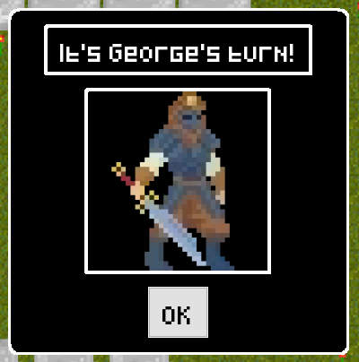  
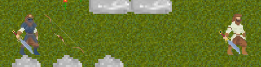  
And also all of the decisions that the NPC had to make to choose what item to equipp and where to go:

	NPC turn: George
	 Getting variable speed from George
	 Getting variable speed from George
	 Getting variable equippedWeapon from George
	 Looking for item with minimum los range 4.071068 or with normal range of 5.0
	 Getting variable range from Sword
	 Getting variable range from Bow
	 Getting variable damage from Bow
	 Getting variable equippedWeapon from George
	 NPC equipped item: bdfdee1526e946a1
	 Getting variable range from Bow
	 Getting variable equippedWeapon from George
	 NPCs (George) desired distance to player: 5.0 using weapon: Bow
	 Generating walkable tiles from 1 4 with speed: 4
	 Generating walkable tiles from 1 4 with speed: 4 and range from goal 5.0
	 3 5 has dist to player: 5.0 (diff: 0.0)
	 NPC (George) walks to 3 5 with path [d, r, r]
	 Line 0 as 6660d03a0b164654: Code for event 'walkOnTile' in 6660d03a0b164654
	 Line 0 as 6660d03a0b164654: Code for event 'walkOnTile' in 6660d03a0b164654
	 Line 0 as 6660d03a0b164654: Code for event 'walkOnTile' in 6660d03a0b164654
	 Getting variable equippedWeapon from George
	 77322049fed14ab2 attacks player using bdfdee1526e946a1
	 Getting variable damage from Bow
	 Evaluating roll: 1W3 + 1
	 Open popup text input 'Rolling 1W3'
	 Result: 2
	 Result (1W3 + 1): 3
	 Rolled a 3 as damage (with armor, armor value: 0)
	 Line 0 as 6660d03a0b164654: Code for event 'damage' in 6660d03a0b164654
	 Getting variable health from George
	 Getting variable health from George
	 Getting variable health from George
	Player turn!
	 ...

Now it's the players turn. We can select the bow and shoot the npc as well:  
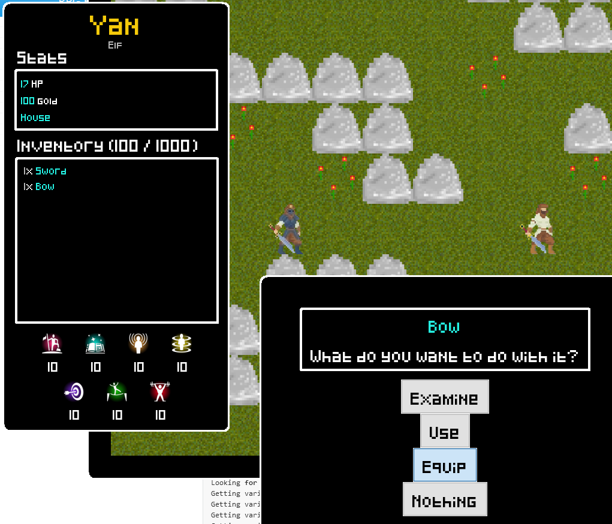  
  
According to the battle map, we only dealt one damage:

	Result (1W3 + 1): 2
	Getting variable armor from George
	Rolled a 1 as damage (with armor, armor value: 1)

This is, because the NPC had an armor value of `1` and we rolled `2` damage. If we get close enough to the NPC, he will not equip his bow, since he knows that on average the sword will deal more damage and he can reach us with his walking action.  
  
If you right click the NPCs you get the chance to see their attributes:  
  

## Commands
You can control pretty much anything that happens on the battle map using commands. You can also check out all of the [commands](commands.md) there are.  
These are all of the commands you can use for a battle map:  

 * ##### `battle start [SELECTOR(battleMap)]`
   Switches to battle mode:
    * Main frame closes
	* Battle map openes, plays intro and begins battle
	* Player stats frame cannot be minimized any more
   
 * ##### `battle stop [VALUE(outcome)]`
   Can be used to trigger the ending of a battle map. This switches back to normal mode. The `outcome` parameter is used for the `end` event.
   
 * ##### `battle set [X] x [Y] [npc;item;extragroundtile;obstacle] [x;y;xy;image;uid] [VALUE] <x [VALUE]>`
   Sets an attribute of an object on a certain tile. Specify what coordinates on the battlemap with `[X] x [Y]` and choose the object type you want to select: `[npc;item;extragroundtile;obstacle]`. Then select what attribute you want to set using `[x;y;xy;image;uid]` and finally the value you want to set it to.  
   Setting the `uid` is only available for npc and item; setting the `image` is only for extragroundtile and obstacles.  
   Also, if you want to set both `x` and `y` at the same time using `xy`, use this format: `0 x 1`  
   A few examples:  
   
		battle set 1 x 1 obstacle image #name:bread#
		battle set 1 x 0 item uid #67f0260423784927#
		battle set 2 x 3 obstacle xy 1 x 4
		battle set {tmp} x {tmp} extragroundtile image #name:bread#
		
   A thing to note is that you can't set `x`, `y` and `xy` while an object is walking or attacking. The change will only be effective after the action took place.
   
 * ##### `battle set [SELECTOR(npc|item);player;groundtiles] [x;y;xy;image;uid] [VALUE] <x [VALUE]>`
   Sets an attribute of an NPC/item via a selector, of the player or the groundtiles.  
   Setting `uid` is only available for npc and item; setting the `image` is only for npc, player and groundtiles; setting `x`, `y` and `xy` is only for npc, item and player.  
   Also, if you want to set both `x` and `y` at the same time using `xy`, use this format: `0 x 1`  
   A few examples:  
   
		battle set #type:npc# xy 0 x 4
		battle set #67f0260423784927# uid #e318489b06eb4aa6#
		battle set groundtiles image #2afdec77bba14448#
   
   A thing to note is that you can't set `x`, `y` and `xy` while an object is walking or attacking. The change will only be effective after the action took place.
   
 * ##### `battle add [X] x [Y] [npc;item;extragroundtile;obstacle] [SELECTOR(npc|item|image)] `
   Adds an object to the battleMap to specific coordinates. For the `npc` you will need to give an additional image. Added NPCs will get added to the turn order as last index.  
   A few examples:  
   
		battle add 1 x 3 obstacle #c859375027884d30#
		battle add 7 x 4 npc #68ea85a4d077420d# img #511309fde13f415f#
   
 * ##### `battle remove [X] x [Y] [npc;item;extragroundtile;obstacle]`
   Removes an object from the battleMap using coordinates.  
   A few examples:  
   
		battle remove 1 x 1 obstacle
		battle remove 1 x 2 npc
   
 * ##### `battle remove [SELECTOR(npc)]`
   Removes an NPC via a selector. An example:  
   
		battle remove #type:npc;sort:random;limit:1#
   
 * ##### `battle refresh [all;overlay;attackanimation;player;npc;item;obstacle;extra;ground]`
   Forces the battleMap gui to be updated. Split multiple parameters with `,` or `;`. A few examples:  
   
		battle refresh overlay,player
		battle refresh all
   
 * ##### `battle active [true;false]`
   Sets the battle into the active or inactive state. In the inactive state, the next round won't start automatically.  
   Setting it to inactive allows for the use of the `battle action` command.
   
 * ##### `battle canend [true;false]`
   Sets whether the battle will end if the health of all enemies reaches 0 or if the player health reaches 0.  
   You will need to end the battle via the `battle stop` command.
   
 * ##### `battle freewalk [true;false]`
   BattleMap needs to be inactive for this command to work.   
   Player will be able to walk to any tile they click.
   
 * ##### `battle action [SELECTOR(npc);player] attack [SELECTOR(npc);player] <using [SELECTOR(item)]>`
   BattleMap needs to be inactive for this command to work.  
   This makes an npc or the player attack another npc or the player. If you leave away the `using [SELECTOR(item)]` parameter, the currently equipped item will be selected. Examples:
   
		battle action #name:Joe;type:npc# attack player using #name:Baguette;type:item#
		battle action player attack #type:npc#
		battle action #name:Joe;type:npc# attack #name:Willi;type:npc#
   
 * ##### `battle action [SELECTOR(npc);player] walk [X] x [Y]`
   BattleMap needs to be inactive for this command to work.  
   Makes an npc or the player walk to a certain coordinate. Examples:  
   
		battle action #name:Joe;type:npc# walk 1 x 5
		battle action player walk 5 x 7
   
 * ##### `battle action [SELECTOR(npc);player] approach [X] x [Y] distance [VALUE]`
   BattleMap needs to be inactive for this command to work.  
   Makes an npc or the player go to a tile that has the given distance from the goal. The distance counts the start tile as one already. Examples:  
   
		battle action player approach 3 x 5 distance 7
		battle action #name:Nameless man# approach {currentbattle}.battleInfo(player|x) x {currentbattle}.battleInfo(player|y) distance 3

Using the commands, you can basically create some kind of a cutscene battle map by making the battle map inactive and using action commands.  
You can also make an exploration map by setting the value of `canend` to `false` and letting the player walk around freely by setting `freewalk` to `true`.