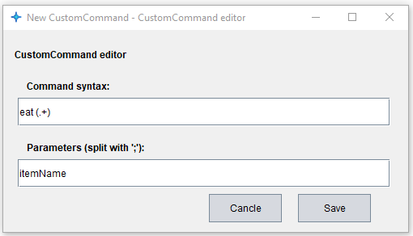

# Custom commands
___

Custom commands can be used by the player to interact with the environment. They allow you to create pretty much any interaction you want, since they are completely customizable.  

## Building a custom command
Let's build a command together: `eat [ITEM]` should trigger an event `eat` at the item with the given name.  
Press `ctrl+n` to create a new custom command and press `ctrl+7` to open the command editor:  
  
The syntax of the command is expressed through a regular expression. You can learn how to build those at [regexr.com](https://regexr.com). Every group that is being captured (groups are captured by `()`) can then be used as a parameter for the command.  
So, our syntax would be: `eat (.+)`  
We want to pass the name as a parameter, so put `itemName` as a parameter in the parameters text field.  
  
If you ever happen to build an invalid reqular expression, the text area turns red and you can't save the command:  
  
Once the player enters a command that matches the regular expression, the `commandExecuted` event is executed, so let's write this one next:  
The event `eat` of the item with the name `itemName` should be executed. This means we need the selector that selects all objects that are items and have the given name: `#type:item;name:{itemName}#`  
Now we need to execute the event: `execute event {event|#type:item;name:{itemName}#|eat} as #type:item;name:{itemName}# {}`  
Which is already everything we need:  
  
Now we need to create the event `eat` for every item that should be consumable. This would be the bread and cheese for me:  
  
I've simply put a `print` statement into the newly created `eat` events: `print I just got eaten! I was a bread...` `print I just got eaten! I was some cheese...`  
Let's try it out! After entering the command, as expected, the command executed the according events:  
  
Also, notice that everything until the first parameter has been colored yellow.  
Now try making it so that the player needs to have at least one of the item type in his inventory in order to be able to eat it!

## Pre coded commands
There are a few basic commands that you can use:  

| Name           | Description                                                                                                                                   |
|----------------|-----------------------------------------------------------------------------------------------------------------------------------------------|
| Talk           | Triggers the event `talkTo` of all NPCs at the current player location                                                                        |
| UseItemWithUID | Triggers the event `use` of the item with the uid given as parameter. Requieres the player inventory to contain at least one of the item type |
| Walk           | Triggers the event `walk` of the current player location                                                                                      |
| Examine        | Triggers the event `examine` of the current location, items in inventory of location, NPCs at current location and items in player inventory  |

The command `UseItemWithUID` is not for the player to enter but for the `Use` button in the player inventory after clicking on an item.